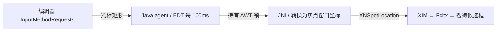

# jetbrains-fcitx-caret-fix

[English](README.en.md) · [兼容范围](docs/COMPATIBILITY.md) · [适配其他版本](docs/PORTING.md)

作者与维护者：[yelianna1001@gmail.com](mailto:yelianna1001@gmail.com)

为旧版 PyCharm 在 Linux X11 + Fcitx 4 + 搜狗输入法下提供候选框位置补丁：当候选框固定在 IDE 左下角、无法跟随编辑光标时，把编辑器报告的光标坐标更新到 XIM 输入上下文。

**v0.1.0 只验证了 PyCharm Professional 2021.1.3、特定构建的 JBR 11 和搜狗 4.2.1 插件。** 项目名表示研究方向，不表示支持所有 JetBrains IDE。PyCharm 2022 / JBR 17、Fcitx 5、Wayland 均未支持；不能仅凭大版本相同安装。

本补丁已在上述组合的真实桌面中验证跟随效果；安装器的自动测试使用模拟环境，不代表其他版本的桌面兼容性。

## 效果与原理

修复前：移动编辑光标后，搜狗候选框仍停留在窗口左下角。

修复后：在验证环境中，候选框跟随编辑位置，并补偿搜狗 XIM 插件额外增加的 50 像素纵向距离。



代码只更新候选位置，不读取输入内容，不模拟按键、不转移焦点、不修改皮肤或合成器。透明皮肤应继续由输入法原有窗口绘制；它并不是通用的黑框修复工具。

## 安装前先确认

- Linux x86_64，X11，会话中的输入法为 Fcitx 4 + 验证过的搜狗插件。
- PyCharm Professional **2021.1.3 / PY-211.7628.24**，自带 **JBR 11.0.11+9-b1341.60-jcef**；还会检查完整原生库 SHA-256。
- 安装器会让这个 PyCharm 使用其自带 JBR，设置进程内 Fcitx 环境，并传入 `-Dsun.java2d.uiScale.enabled=false`。**切换 JDK 可能改变默认字体，禁用 Java UI 缩放也可能改变显示大小。** 请先记录 Editor → Font 的字体、字号及显示设置，参阅[排查说明](docs/TROUBLESHOOTING.md)。
- 所有修补均限指定 IDE 安装目录；不更改用户字体配置、全局 Java、搜狗皮肤或输入法自启。需要对该目录有写权限。

## 使用发布包

从项目 Releases 下载 `jetbrains-fcitx-caret-fix-0.1.0-linux-x86_64.zip` 及同名 `.sha256` 文件，在下载目录校验、解压，然后进入解压目录执行：

```bash
sha256sum -c jetbrains-fcitx-caret-fix-0.1.0-linux-x86_64.zip.sha256
unzip jetbrains-fcitx-caret-fix-0.1.0-linux-x86_64.zip
cd jetbrains-fcitx-caret-fix-0.1.0
bash install.sh --ide-dir /path/to/pycharm-2021.1.3 --check
bash install.sh --ide-dir /path/to/pycharm-2021.1.3
```

随后保存工作，完全退出并重新打开 PyCharm。安装器不会主动关闭或启动软件。候选框的可见边缘与光标之间仍可能有皮肤透明边距。

脚本默认检查两个常见的搜狗插件位置；特殊安装目录可增加 `--sogou-plugin /path/to/fcitx-sogoupinyin.so`，完整哈希校验仍然生效。它不是跳过兼容检查的开关。

检查、卸载：

```bash
bash diagnose.sh --ide-dir /path/to/pycharm-2021.1.3
bash uninstall.sh --ide-dir /path/to/pycharm-2021.1.3 --check
bash uninstall.sh --ide-dir /path/to/pycharm-2021.1.3
```

卸载恢复原启动脚本并保留备份归档，不依赖当前仍是旧版 JBR / 搜狗 / X11。安装后若启动脚本被另行修改，会拒绝覆盖，需人工比较。安装状态位于 IDE 下的 `.pycharm-ime-fix/`；不要删除其中的原文件备份。已有早期手动补丁的设备无需重装本包。

## 从源码构建

依赖：Bash、GNU coreutils、awk、grep、GCC、libX11 开发头文件和库、JDK 11+（推荐 JDK 11）、Python 3.8+ 标准库。脚本不会自动安装依赖。发布包的安装和卸载无需 Python 或编译器。

```bash
# 可选：指定编译 JDK 和已存在的 Python 环境
export CARET_BUILD_JDK=/path/to/jdk-11
export CARET_PYTHON=/path/to/python3
bash build.sh
"$CARET_PYTHON" -B -m unittest discover -s tests -v
bash package.sh
```

若 PATH 已有这些工具，可不设置上述两个变量，用 `python3` 执行测试。构建生成 `payload/` 和 `SHA256SUMS`；打包产物在 `dist/`。源码仓库不提交编译产物，GitHub 自动生成的源码 ZIP 需要先构建。

新系统构建的 `.so` 可能要求更高的 glibc。给旧设备发布时应在相应旧系统构建并实测；GitHub CI 产物不自动视为 Ubuntu 18.04 可用。详见[测试](docs/TESTING.md)与[发布](docs/RELEASING.md)。

## 适配与反馈

遇到相似问题可参照 [PORTING.md](docs/PORTING.md) 定位坐标链路。不得通过修改哈希白名单强行支持未验证 JBR：JNI 访问了版本相关的私有内存结构。

提交 issue 时附 IDE 完整构建号、实际运行 JBR、桌面会话、输入法版本及 `diagnose.sh` 输出；只上传与问题相关的日志片段。请参考[贡献指南](CONTRIBUTING.md)。

原创代码和文档采用 [MIT](LICENSE)。依赖和参考项目的归属见 [THIRD_PARTY_NOTICES.md](THIRD_PARTY_NOTICES.md)；本项目不是 JetBrains、Fcitx 或搜狗的官方产品。
